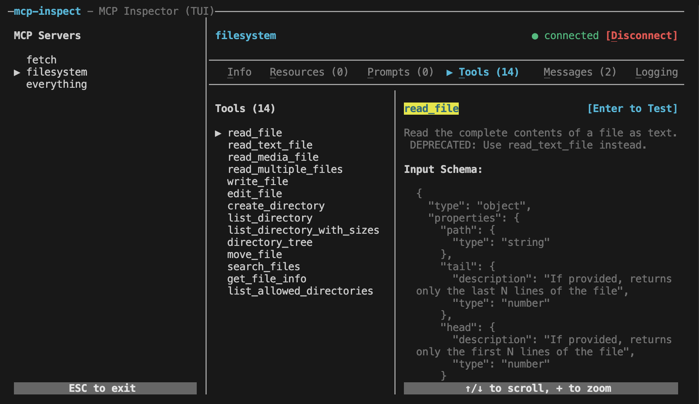

# mcp-inspect

A terminal UI (TUI) inspector for Model Context Protocol (MCP) servers. Inspect server capabilities, resources, prompts, tools, message history, and MCP server logs, and test MCP tools, all in an interactive terminal interface.  Similar to [MCP Inspector](https://modelcontextprotocol.io/docs/tools/inspector) but works from any terminal session, including inside of sandboxes or containers. 



> **🎥 Watch the Demo:** Check out the [**mcp-inspect Introduction and Demo**](https://youtu.be/7dvSA8VRIrs) video to see how to inspect MCP servers, test tools, browse resources, and monitor server activity—all from your terminal.

## Installation

```bash
npm install -g mcp-inspect
```

Or use via npx:

```bash
npx mcp-inspect <config-file.json>
```

## Usage

```bash
mcp-inspect <config-file.json>
```

Where `config-file.json` is your MCP configuration file (typically `mcp.json`).

### Configuration File Format

The configuration file should follow the MCP configuration format:

```json
{
  "mcpServers": {
    "server-name": {
      "type": "stdio",
      "command": "node",
      "args": ["server.js"]
    },
    "another-server": {
      "type": "sse",
      "url": "http://localhost:6969/sse"
    }
  }
}
```

Supported transport types:
- `stdio` - Standard input/output communication
- `sse` - Server-Sent Events
- `streamableHttp` - Streamable HTTP

## Features

- **Server Management**: Connect to multiple MCP servers simultaneously
- **Resource Inspection**: Browse and view available resources
- **Prompt Templates**: View and inspect prompt templates
- **Tool Testing**: Test MCP tools with custom inputs and view results
- **Message History**: Track all requests, responses, and notifications
- **Logging**: View server stderr output and notifications
- **Interactive UI**: Navigate with keyboard shortcuts

## Keyboard Shortcuts

### Global
- `ESC` - Exit application
- `Ctrl+C` - Exit application
- `Tab` / `Shift+Tab` - Cycle focus between panes
- `↑` / `↓` - Navigate lists and scroll content
- `Enter` - Select item / Test tool
- `+` - Zoom to full-screen modal view (in details panes)

### Tabs
- Quick switch to tabs:
  - `I` - Info
  - `R` - Resources
  - `P` - Prompts
  - `T` - Tools
  - `M` - Messages
  - `L` - Logging

### Server Management
- `C` - Connect to selected server (when disconnected or in error state)
- `D` - Disconnect from selected server (when connected)

### Tool Testing
- `Enter` - Test tool (from tool list or details view)

## Development

```bash
# Install dependencies
npm install

# Build
npm run build

# Run in development mode
npm run dev <config-file.json>
```

## License

MIT

## Contributing

Contributions welcome! Please open an issue or submit a pull request.
